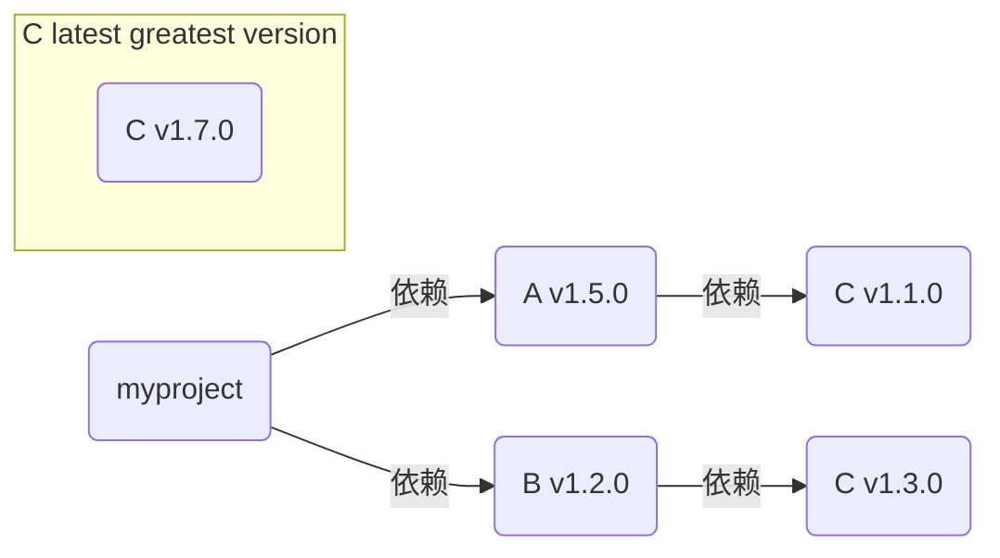

# Go 语言第一课 04

## Go 构建模式的演化

Go 程序的构建过程就是**确定包版本、编译包以及将编译后得到的目标文件链接在一起**的过程。

### GOPATH 构建机制

Go 编译器可以在本地 GOPATH 环境变量配置的路径下，搜寻 Go 程序依赖的第三方包。

* 假设 Go 代码中引用了 `github.com/user/repo` 则在构建的时候会从`$GOROOT/src/github.com/user/repo`, `$GOPATH/src/github.com/user/repo` 目录下依次搜索第三方依赖包是否存在。
* 如果不存在，则可以通过 `go get github.com/user/repo` 将包下载到本地。go get **下载的包只是那个时刻各个依赖包的最新主线版本**。这种方式会有如下问题
  * 依赖包持续演进，可能会导致不同开发者在不同时间获取和编译同一个 Go 包时得到不同的结果
  * 依赖包若引入了不兼容代码，则无法构建

### vendor 构建机制

vendor 机制本质上就是**在 Go 项目的某个特定目录下，将项目的所有依赖包缓存起来**，这个特定目录名就是 vendor。

* **Go 编译器会优先感知和使用 vendor 目录下缓存的第三方包版本**，而不是 GOPATH 环境变量所配置的路径下的第三方包版本。
* 要想开启 vendor 机制，你的 Go 项目必须位于 GOPATH 环境变量配置的某个路径的 src 目录下面。

但是 vendor 机制有如下问题：

* vendor 目录需要提交到代码仓库，占用空间，影响开发效率
* 需要手工管理 vendor 下面的 Go 依赖包。

### Go Module 机制

一个 Go Module 是一个 Go 包的集合。

* module 是有版本的，所以 module 下的包也就有了版本属性。这个 module 与这些包会组成一个独立的版本单元，它们一起打版本、发布和分发。
* 通常一个代码仓库对应一个 Go Module

我们只需在当前 module 的根路径下，执行 go build 就可以完成 module 的构建，构建的过程：

* go build 命令会读取 go.mod 中的依赖及版本信息，在本地 module 缓存路径下找到对应版本的依赖 module，执行编译和链接

#### Go Module 的语义导入版本机制

在 Go Module 构建模式下，一个符合 Go Module 要求的版本号，由**前缀 v 和一个满足语义版本规范的版本号组成** `vX.Y.Z`。借助于语义版本规范，Go 命令可以确定同一 module 的两个版本发布的先后次序，而且可以确定它们是否兼容。

* 如果同一个包的新旧版本是兼容的，那么它们的包导入路径应该是相同的。

  ```go
  // logrus v1.7.0 和 v1.8.0 导入路径应该是相同的
  import "github.com/sirupsen/logrus"
  ```

* 如果不兼容，**将包主版本号引入到包导入路径中**

  ```go
  // logrus v2.0.0 导入路径包含版本号
  import "github.com/sirupsen/logrus/v2"
  ```

#### Go Module 的最小版本选择原则



A 明明说只要求 C v1.1.0，B 明明说只要求 C v1.3.0。

所以 Go 会在该项目依赖项的所有版本中，**选出符合项目整体要求的“最小版本”**，也就是 C v1.3.0，而不是C v1.7.0

## Go Module 常见操作

### 为当前 module 添加一个依赖

```sh
# 新建一个 moduleproject
mkdir moduleproject
cd moduleproject
go mod init github.com/myangvgo/moduleproject

# 为当前的项目添加一个新的依赖
go get github.com/google/uuid
go get github.com/sirupsen/logrus
```

`main.go`

```go
package main

import (
	"github.com/google/uuid"
	"github.com/sirupsen/logrus"
)

func main() {
	logrus.Println("hello, go module mode")
	logrus.Println(uuid.NewString())
}

```

### 升级 / 降级依赖的版本

```sh
# 首先查看依赖包的版本

go list -m -versions github.com/sirupsen/logrus

# 如果要安装指定的版本，比如 v1.8.1
go get github.com/sirupsen/logrus@v1.8.1
go: downgraded github.com/sirupsen/logrus v1.9.0 => v1.8.1

# 或者通过 go mod
go mod edit -require="github.com/sirupsen/logrus@v1.8.1"
go mod tidy
```

### 添加一个主版本号大于 1 的依赖

这里以空导入的方式导入 v7 版本的 `github.com/go-redis/redis` 包

```go
package main

import (
    _ "github.com/go-redis/redis/v7"
	"github.com/google/uuid"
	"github.com/sirupsen/logrus"
)

func main() {
	logrus.Println("hello, go module mode")
	logrus.Println(uuid.NewString())
}

```

此时执行 go get

```sh
go get github.com/go-redis/redis/v7

go: downloading github.com/go-redis/redis v6.15.9+incompatible
go: downloading github.com/go-redis/redis/v7 v7.4.1
go: added github.com/go-redis/redis/v7 v7.4.1
```

如果要升级到 v8，首先修改包导入 `    _ "github.com/go-redis/redis/v8"`，然后再执行

```sh
go get github.com/go-redis/redis/v8
```

### 移除一个依赖

```sh
# 从源码中移除 redis 包的引用

# 执行 go mod tidy
go mod tidy 会自动分析源码依赖，而且将不再使用的依赖从 go.mod 和 go.sum 中移除

# 再查看 module
go list -m all
```

### Go Module 下的 vendor 机制

在一些不方便访问外部网络，并且对 Go 应用构建性能敏感的环境，比如在一些内部的持续集成或持续交付环境（CI/CD）中，使用 vendor 机制可以实现与 Go Module 等价的构建。

```sh
# 快速建立和更新 vendor 目录
go mod vendor

$ tree -LF 2 vendor
vendor
|-- github.com/
|   |-- google/
|   `-- sirupsen/
|-- golang.org/
|   `-- x/
`-- modules.txt

5 directories, 1 file
```

go mod vendor 命令在 vendor 目录下，创建了一份这个项目的依赖包的副本，并且通过 vendor/modules.txt 记录了 vendor 下的 module 以及版本。

构建的时候可以选择 mod 或者 vendor

```sh
# mod 构建
go build -mod=mod
# vendor 构建
go build -mod=vendor
# rebuild 显示构建输出
go build -a -v
```


[返回目录](../README.md)

